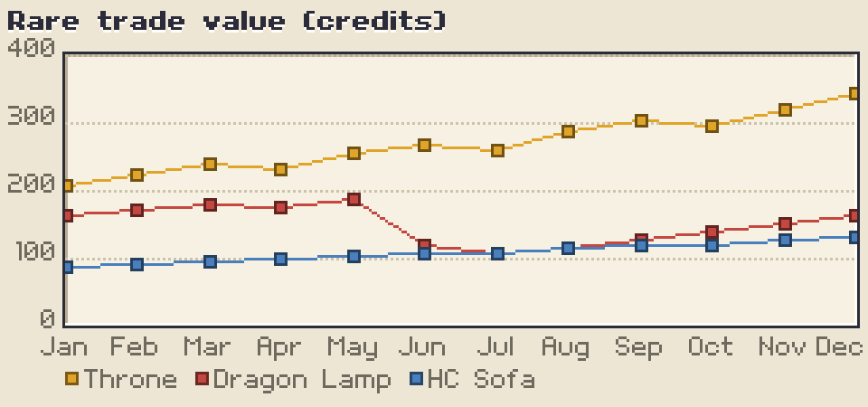
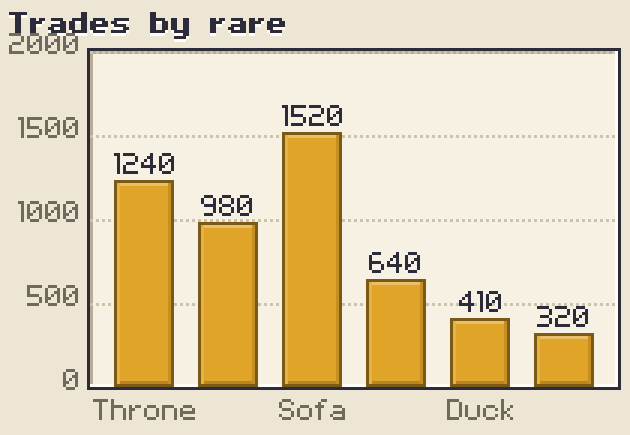
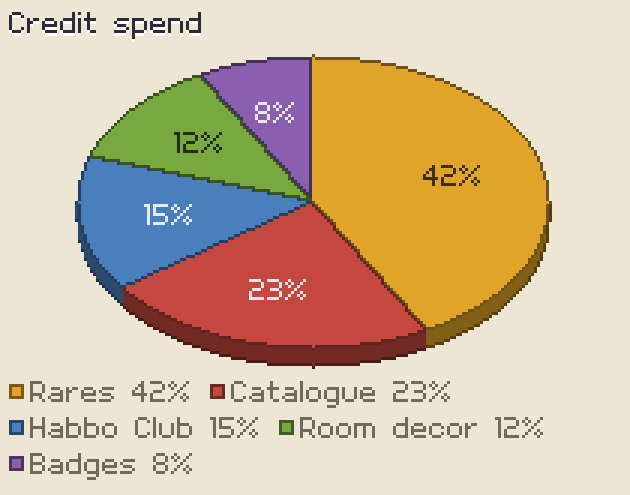
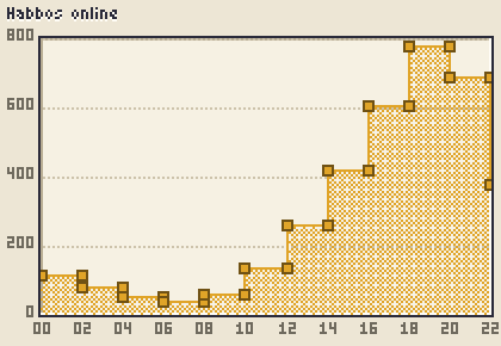

# Volter Graph

[](https://github.com/pensdev/voltergraph/actions/workflows/ci.yml)
[](LICENSE)

Pixel-art charts for the web. No antialiasing, ever.

Bar, line and pie. 11.5 KB min+gzip, zero runtime dependencies, TypeScript throughout.

**[Live demo →](https://pensdev.github.io/voltergraph/)**



| | |
|:--|:--|
|  |  |
|  | Every image here is a real render at 3x nearest-neighbour, not a mockup. Regenerate with `npm run docs`. |

## Install

Not on npm yet. Install from the repository:

```bash
npm install github:pensdev/voltergraph
```

```ts
import { VolterGraph } from 'volter-graph';

new VolterGraph('#chart', {
  type: 'line',
  data: {
    labels: ['Jan', 'Feb', 'Mar', 'Apr', 'May', 'Jun'],
    datasets: [
      { label: 'Users', data: [12, 19, 17, 28, 34, 31] },
      { label: 'Rooms', data: [8, 11, 15, 14, 22, 27] },
    ],
  },
  options: { title: 'Growth', area: true },
});
```

## See it

**Open [`docs/index.html`](docs/index.html) in a browser.** It is a complete
self-contained page — the library, the demo and the styles are all inlined, so
it needs no install, no server and no build step. Double-click it from a clone
and the charts are there.

Do *not* open `demo/index.html` directly. That one loads `main.ts`, and browsers
cannot execute TypeScript — you get the page with five empty boxes. It exists so
the dev server can hot-reload; use it with `npm run dev`.

| Script | What it does |
|:--|:--|
| `npm install` | Needed once before any script below |
| `npm run dev` | The demo page with live reload |
| `npm test` | Unit and golden-image tests |
| `npm run build` | ESM, CJS, IIFE and types into `dist/` |
| `npm run preview` | Sample renders into `preview/` for eyeballing |
| `npm run docs` | Regenerates the README images |
| `npm run artifact` | Rebuilds `docs/index.html`, the self-contained page |

## Why it isn't built on Canvas2D

Canvas' vector API antialiases strokes, arcs and text, and there is no flag to
turn that off — `imageSmoothingEnabled` only governs *image* scaling. So the
library rasterizes into its own `Uint32Array` framebuffer at logical pixel
resolution, then blits that to a canvas scaled up by an **integer** factor with
smoothing disabled.

That buys three things beyond crisp edges:

- **Dithering.** Shading is a Bayer or checker pattern, not an alpha value.
  Overlapping area fills use different dither densities, so they stay readable
  where alpha would just produce off-palette mud.
- **Determinism.** Identical input produces byte-identical output on every
  machine, which makes exact golden-image tests a fair assertion rather than a
  flaky one.
- **No DOM in the hot path.** Tooltips, legends and panels are drawn pixels.

## Chart types

**Bar** — single and grouped series, negative values straddling a zero
baseline, optional value labels that move inside the bar when it reaches the
axis extreme.

**Line** — 1px Bresenham paths, square markers that disable themselves when
points get closer than 8px, optional dithered area fill and stepped mode.
Hovering snaps to the nearest column and shows a crosshair plus one tooltip
listing every series at that column. Non-finite values break the path into
segments rather than being interpolated across, which would invent data.

**Pie** — flat, donut, or extruded with a tilt. This is the one that needed a
different rasterizer entirely: an arc is a curve, and every vector renderer
resolves that with antialiasing. Instead the pie builds a mask of slice indices
by testing each pixel's angle directly, then derives the outlines from
*boundaries in that mask*. One edge-detect pass yields the circumference, the
radial dividers and the donut hole at once — all exactly 1px, all exactly
registered against the fill they enclose. The extruded look is the same mask
stamped downward in a darker shade under painter's ordering.

## The pixel-grid problems

Most of the work in a pixel chart library is in places a normal chart library
never has to think about.

**Gridlines must be evenly spaced in pixels, not just in value space.** The
usual approach — pick nice tick values, map through a continuous scale, round at
draw time — yields gridlines at 13, 26, 40, 53. The uneven gap reads as a bug.
`fitAxis` inverts the order: choose the tick step, choose an integer
pixels-per-step, then shrink the axis to `pxPerStep * stepCount` and hand the
leftover pixels back as padding. Even spacing then holds by construction.

**Bars must not jitter.** Rounding each band independently makes bars shift by a
pixel as data changes. `bandScale` derives slot edges from one rounded cumulative
division, so there are no gaps, no overlaps, and the leftover pixels land in a
deterministic place. Line columns use the same rule.

**Thick lines don't exist.** There is no correct "stroke width 3" at this scale.
`outlinedPolyline` draws a 1px core with a 1px offset outline; a generic
thickener produces lumpy joins. There is no smooth/spline option for the same
reason — a Catmull-Rom curve at 1px is indistinguishable from noise.

**Text is a bitmap.** `src/core/fonts/volter5.ts` is a hand-drawn 5px-cap face
stored as ASCII art. Glyphs are `[yOffset, ...rows]` with `#` for ink:

```ts
A: [0, '###', '#.#', '###', '#.#', '#.#'],
```

Editing it directly is the intended workflow — at this size every pixel is a
design decision and a hinted vector face just produces mush. All ten digits
share one advance width so numeric columns line up.

## Responsive behaviour

**Zoom is an integer, always.** With `zoom: 'auto'` (the default) the renderer
picks 2–4 device pixels per logical pixel from the container's width, so a chart
stays chunky on a phone and gains detail rather than blur on a desktop monitor.
`devicePixelRatio` is floored to an integer and folded into the backing store on
top of that. The chart gains *more pixels* as it grows, never bigger ones.

**Height is optional.** A container with no height of its own gets one from
`aspectRatio`, which defaults to a taller ratio on narrow screens — 16:9 leaves
no room for a title, a legend and an axis at once on a phone.

**Legends wrap.** On a narrow chart the legend is frequently wider than the plot,
and a single clipped row loses series names silently.

**Category labels thin out.** Labels are dropped at a uniform stride until the
survivors stop colliding. The check runs on the *clamped* positions: an edge
label pushed inward to stay on canvas moves toward its neighbour, so testing raw
centers misses exactly the collision that clamping creates.

**Touch is a first-class input.** The canvas sets `touch-action: pan-y`, so
vertical scrolling still works while horizontal drags drive the crosshair. A tap
stands in for hover and the tooltip *survives the release* — clearing on
`pointerup` would make a tap flash the value and hide it again. It clears on the
next tap that resolves to nothing, or on `pointercancel` when the gesture turns
into a scroll.

One consequence worth knowing: a canvas sized in CSS pixels contributes its full
width to its parent's intrinsic size, so inside a grid or flex track the
container can never report shrinking. `max-width: 100%` would fix the layout and
destroy the pixel grid, so `CanvasRenderer` collapses the canvas for the duration
of each measurement instead. Your container needs no special CSS.

## Accessibility

Everything drawn into the framebuffer is invisible to assistive technology, so
every chart also emits a visually-hidden `<table>` of its data, kept in sync on
every render. It doubles as the print and no-JS fallback.

## Testing

`npm test` runs 72 tests: unit coverage for the rasterizer, color packing, font
metrics, scales, legend wrapping, label thinning and hit testing, plus
golden-image comparisons that encode the framebuffer to PNG in Node — no
browser, no dependencies — and compare hashes. Any stray antialiasing or
off-by-one shows up immediately.

```bash
UPDATE_GOLDEN=1 npm test
```

rewrites the references after an intended visual change. A failing comparison
writes `<name>.actual.png` next to the golden for eyeballing.

## Layout of the source

```
src/core/      framebuffer, rasterizer, dither patterns, bitmap font, panels
src/scale/     pixel-integer axis fitting, linear and band scales
src/charts/    bar, line, pie; shared layout, legend, tooltip, formatting
src/theme/     palettes
src/render/    the integer-scale canvas blitter
src/a11y/      hidden data table
```

## Status

Bar, line and pie are done. Scatter and stacked bars are not written yet — the
rasterizer and scales already support both, so they are chart-layer work rather
than new plumbing.

## A note on the name

Volter and Volter Goldfish are Ben Johnson's fonts and are not freely
redistributable, so nothing here is derived from them. The bundled `volter5` face
is original work; swap in any other bitmap font via `compileFont`.

## License

MIT.
